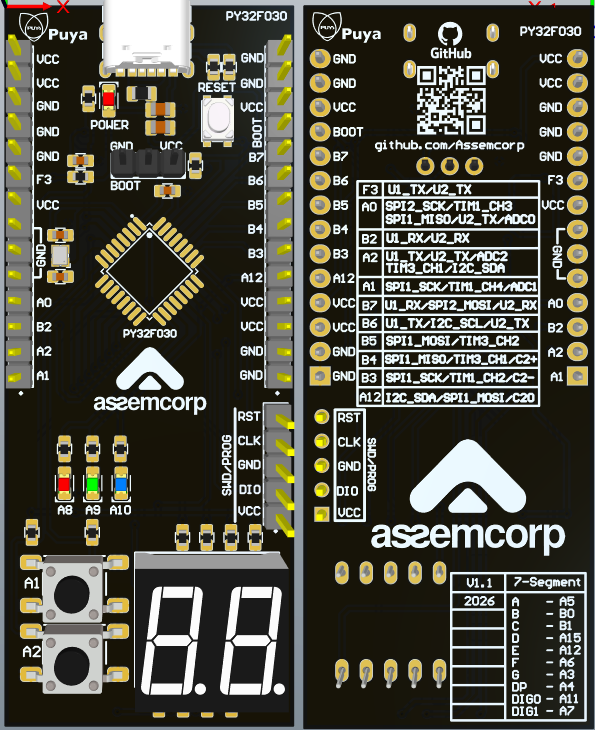

PY32F030 Resources and Examples This repository contains documentation, sample codes, and useful references for working with the PY32F030 microcontroller.

You'll find:

Datasheet and Referance Manual.

Peripheral usage examples (GPIO, UART, I2C, SPI, ADC, etc.)

Development tips and practical notes

Board schematics.

Whether you're prototyping or building a production-ready system, these resources are aimed at helping you get the most out of the PY32F030 MCU.

#AssemCorpApplicationTeam

